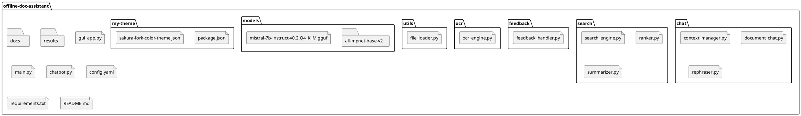

<p align="left">
  
</p>

# 🧠 Offline AI-Powered Document Assistant

A powerful offline AI assistant for intelligent document processing and interaction. Features advanced search capabilities, OCR support, chat functionality, content summarization, and adaptive learning from user feedback. Built for secure enterprise environments requiring complete data privacy.

---

## 🚀 Key Features

### 📄 **Multi-Format Document Support**
- **PDF Processing**: Text extraction with OCR fallback for scanned documents
- **Word Documents**: Full .docx support with paragraph-level processing
- **Text Files**: Direct text processing with line-by-line indexing
- **Image-based PDFs**: Automatic OCR using EasyOCR for scanned content

### 🔍 **Advanced Search Engine**
- **Hybrid Search**: Combines semantic similarity and fuzzy matching
- **OCR Integration**: Searches through scanned documents and images
- **Smart Abbreviation Expansion**: Configurable mapping (Ltd → Limited, etc.)
- **Typo Tolerance**: High-threshold fuzzy matching for resilient search
- **Contextual Results**: Page and line number references for precise location

### 💬 **Interactive Chat Interface**
- **Document Conversations**: Ask questions and get contextual answers
- **Context Management**: Maintains conversation history per session
- **Multi-document Support**: Independent context isolation for different documents
- **Real-time Responses**: Powered by local Mistral 7B model

### 📝 **Content Processing**
- **Intelligent Summarization**: Multiple length options (short/medium/long)
- **Flexible Rephrasing**: Support for various tones (formal, casual, technical, etc.)
- **Query-based Summaries**: Targeted summaries based on user queries
- **Search Result Summarization**: Consolidated insights from multiple matches

### 🎯 **Adaptive Learning**
- **Feedback System**: Learn from user relevance ratings
- **Persistent Memory**: Saves feedback to improve future searches
- **Score Adjustment**: Combines semantic, fuzzy, and feedback scores
- **Continuous Improvement**: Gets better with usage

---

## 🛠️ Technical Architecture

| Component | Implementation | Purpose |
|-----------|---------------|---------|
| **LLM Engine** | Mistral 7B Instruct (llama.cpp) | Chat, summarization, rephrasing |
| **Embeddings** | SentenceTransformers (all-mpnet-base-v2) | Semantic search |
| **OCR Engine** | EasyOCR + Tesseract | Scanned document processing |
| **Search** | Hybrid (semantic + fuzzy) | Robust document retrieval |
| **Feedback** | JSON-based storage | Learning from user interactions |
| **UI** | Command-line interface | Interactive document exploration |

---


## 📁 Project Structure



---

## ⚙️ Configuration Options

The `config.yaml` file provides extensive customization:

### Document Processing
- **Input/Output folders**: Configurable document and results directories
- **OCR settings**: Enable/disable OCR, language support (English, Hindi, etc.)
- **File format support**: PDF, DOCX, TXT processing

### AI Models
- **LLM Configuration**: Model path, context window, temperature, GPU layers
- **Embedding Model**: Sentence transformer model selection
- **Performance Tuning**: Thread count, memory locking, GPU acceleration

### Search Behavior
- **Fuzzy Matching**: Adjustable similarity thresholds
- **Abbreviation Mapping**: Custom business terminology expansion
- **Result Ranking**: Weighted scoring system

### Content Generation
- **Summary Lengths**: Short (150 tokens), Medium (300), Long (500)
- **Rephrasing Styles**: Formal, simplified, conversational, technical
- **Response Tones**: Customizable output formatting

---

## 🚀 Quick Start

### 1. Installation
```bash
git clone https://github.com/your-org/offline-doc-assistant.git
cd offline-doc-assistant
pip install -r requirements.txt
```

### 2. Model Setup
Download the Mistral 7B model:
```bash
mkdir models
# Download mistral-7b-instruct-v0.2.Q4_K_M.gguf to models/
```

### 3. Document Preparation
```bash
# Place your documents in the docs/ folder
cp your-documents.pdf docs/
cp your-files.docx docs/
```

### 4. Configuration
Edit `config.yaml` to match your system:
- Set correct model paths
- Adjust GPU layers based on your hardware
- Configure OCR languages if needed

### 5. Run the Application
```bash
python main.py
```

---

## 💡 Usage Examples

### Basic Search
```
🔎 Enter your search query: employee benefits policy
```

### Interactive Features
- **Feedback**: Rate results as relevant/irrelevant to improve future searches
- **Rephrasing**: Convert formal text to casual tone or vice versa
- **Summarization**: Get concise overviews of search results
- **Chat Mode**: Ask follow-up questions about document content

### Advanced Queries
- **Abbreviation-aware**: "Ltd company registration" → "Limited company registration"
- **OCR-enabled**: Searches through scanned PDF content
- **Context-sensitive**: Maintains conversation flow for related questions

---

## 🖥️ Graphical User Interface (Offline)

You can use the offline GUI with Streamlit:

```bash
streamlit run gui_app.py
```

This launches a local web app for searching, chatting, summarizing, and rephrasing your documents – all offline.

---

## 🔐 Privacy & Security

- **100% Offline**: No internet connection required after setup
- **Local Processing**: All data remains on your system
- **Enterprise Ready**: Suitable for confidential document processing
- **No Cloud Dependencies**: Complete data sovereignty

---

## 🎯 Use Cases

- **Enterprise Document Search**: Find information across large document repositories
- **Research Assistance**: Quickly locate relevant content in academic papers
- **Compliance Documentation**: Search through policy and procedure documents
- **Knowledge Management**: Interactive exploration of organizational knowledge bases
- **Legal Document Review**: Efficient search through contracts and agreements

---

## 📊 Performance Features

- **GPU Acceleration**: Configurable GPU layers for faster processing
- **Memory Optimization**: Efficient document indexing and retrieval
- **Batch Processing**: Handles multiple documents simultaneously
- **Incremental Learning**: Improves accuracy through user feedback

---

## 🛠️ System Requirements

- **Python**: 3.8+
- **RAM**: 8GB minimum (16GB recommended)
- **Storage**: 5GB for models + document storage
- **GPU**: Optional (CUDA-compatible for acceleration)
- **OS**: Windows, Linux, macOS

---

## 📈 Development Roadmap

- [ ] Web interface (Streamlit/Flask)
- [ ] Real-time document monitoring
- [ ] Advanced analytics dashboard
- [ ] Multi-language OCR expansion
- [ ] Export/import of feedback data
- [ ] API endpoint development

---

## 👥 Contributors

- **Pranav Akshit** – Core chat functionality, context management, OCR integration
- **Ananya Rana** – Search engine, feedback learning, summarization, content rephrasing

---

## 📄 License

This project is designed for enterprise use with full offline capabilities and data privacy compliance.

---

## 🤝 Support

For technical issues or feature requests, please refer to the configuration documentation in `config.yaml` or check the code comments for implementation details.